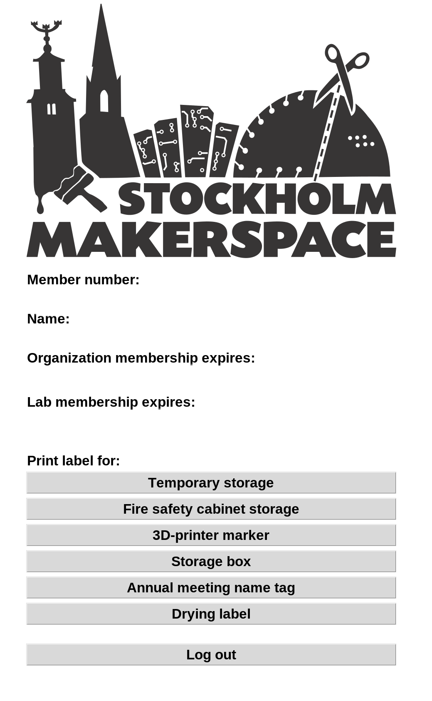
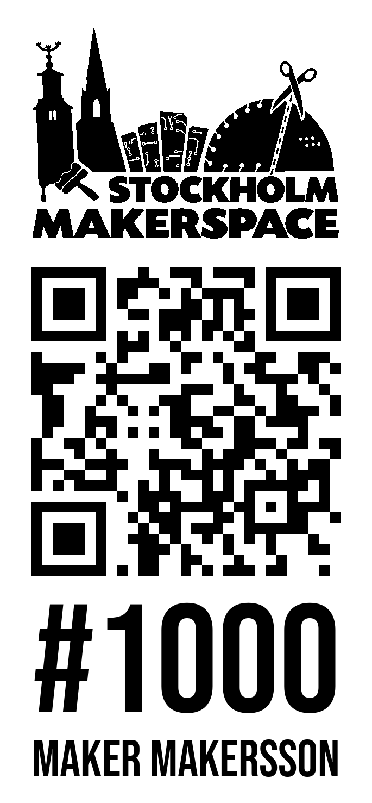
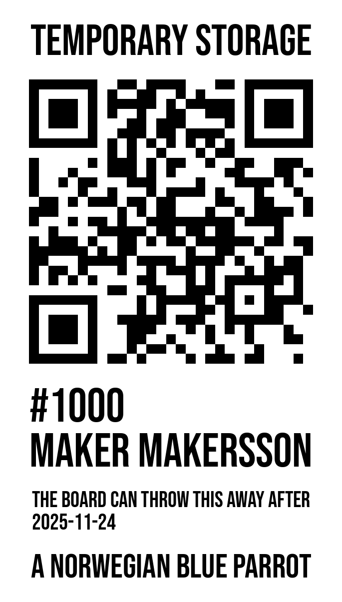
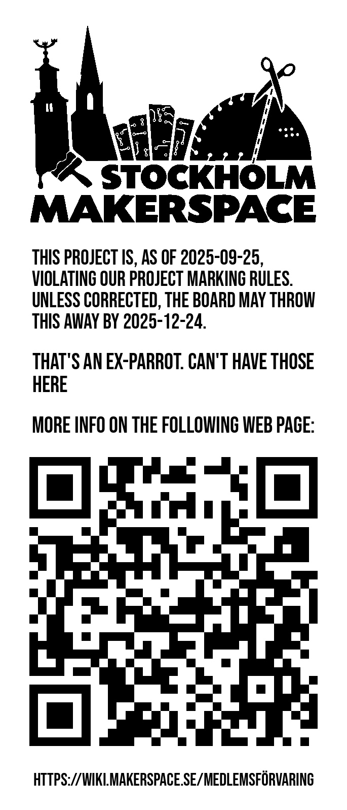
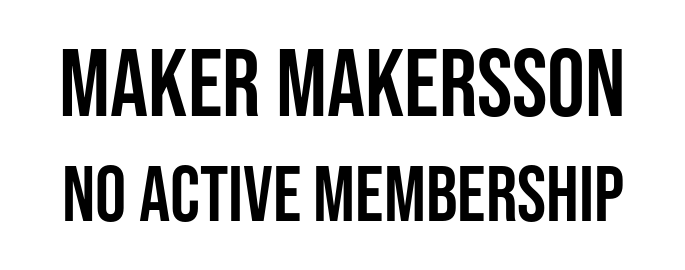
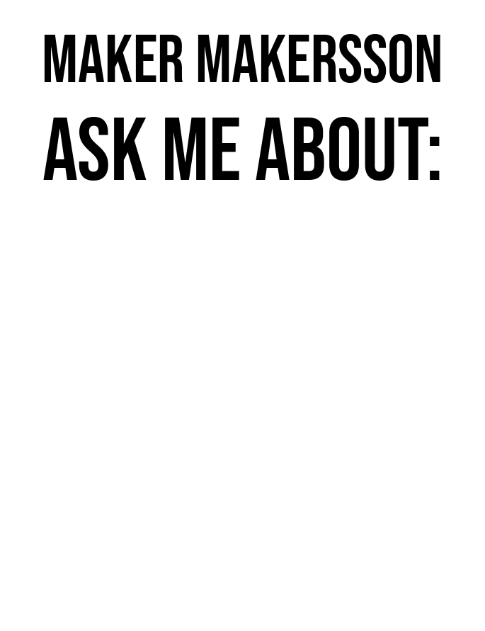
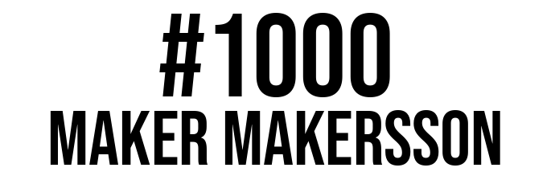

# Memberbooth

A GUI application for letting members log in on a public machine and interact with their data. It connects to a [makeradmin](https://github.com/makerspace/makeradmin) backend where the data resides. Memberbooth can perform the following:
* Display current member status (lab membership end date)
* Print labels for storage boxes (with QR code that can be scanned with the box-terminator functionality built-in to makeradmin) and labels for other temporary storage.

Optional Slack usage logging can be enabled.

This is used at Stockholm Makerspace for their [memberbooth](https://wiki.makerspace.se/Memberbooth).



## Prerequisites

- You need to obtain a token from the makeradmin backend that has the correct permissions for accessing the "memberbooth" endpoints. You can find it in the Settings page.

## Installation

**Supported OS**: Linux (possibly works on mac and windows too, but not guaranteed)

Install the `uv` package manager: https://docs.astral.sh/uv/getting-started/installation/

## Usage

### Starting up the memberbooth
*memberbooth.py* runs the memberbooth GUI application.

```bash
uv run ./memberbooth.py
```

If you want to run against a custom backend (e.g. for development purposes), then you need to supply the `-u` argument.

### Logging in
The memberbooth application is then logged in by running the *login.py* script. This script will log in to the backend and a optionally a slack notification system.

### Printing labels from the command line
*print_label.py* prints labels for members.

```bash
uv run ./print_label.py <member_number> --no-printer --type=box
```

## Types of labels

Example label images can be found in the [examples directory](./examples):

### Box label


### Temporary storage label


### Warning label


### Name tag


### Meetup label


### 3D printer filament label


## Supported printers

- [Brother QL 800](https://store.brother.se/catalogs/brothersweden/devices/label-printer/ql/ql800)
- [Brother QL 800W](https://store.brother.se/catalogs/brothersweden/devices/label-printer/ql/ql810w)
- Possibly more models in the Brother QL series

Note that the "Editor Lite" mode must be *off* for it to work.
